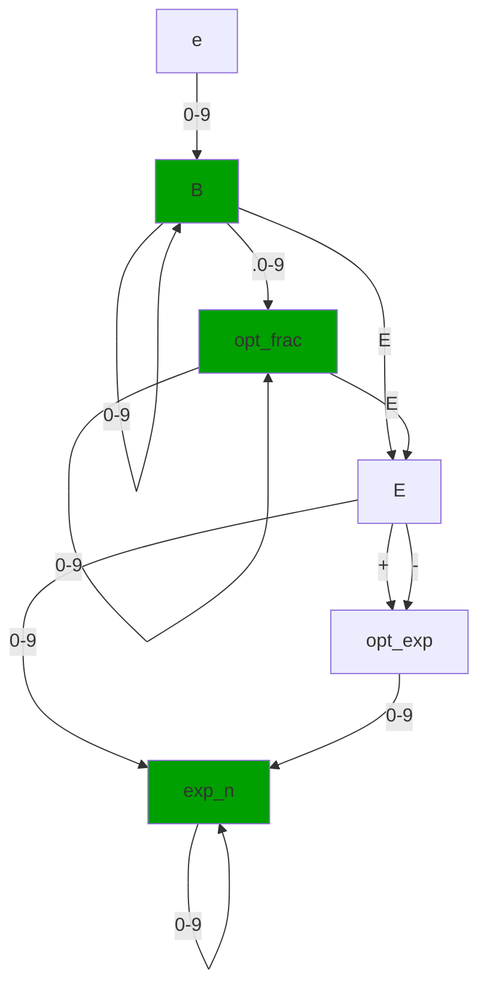
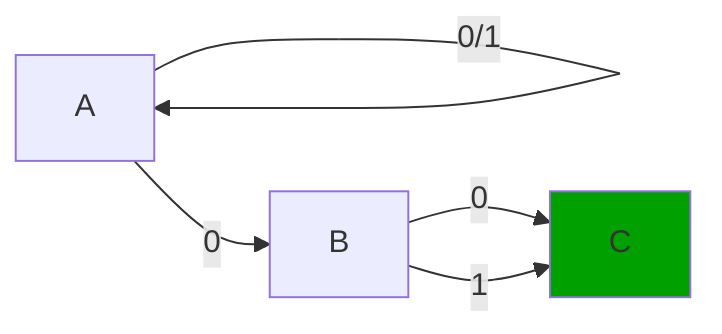
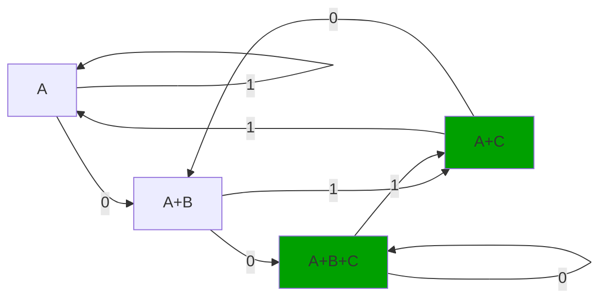

## Ćwiczenia 1
***
### Zadanie 1
Automat skończony do rozponznania ciągów reprezentujących komentarze. Czyli <// rzeczy \n> oraz </* */>

(Zakładamy że każde nielegalne przejście powoduje wejście w stan nieakceptujący, bez możliwości wyjścia z niego)

***
### Zadanie 2
Napisz regex akceptujący wyrażenia regularne  
`(\/\*[^\*]*\*\/)|(\/\/.*$)`

objaśnienie:  
- capture group1 `(\/\*[^\*]*\*\/)`
    - literalnie `/*`
    - następnie dowolnie wiele znaków niebędących literalnie `*` (za pomocą `[^\*]*`)
    - następnie literalnie `*/` 
- capture group2 `(\/\/.*$)`
    - literalnie `//`
    - następnie dowolnie wiele dowolnych znaków `.*`
    - zakończenie stringa `$` chociaż bezpieczniej zamiast `.*` prosić o `[^\n]*` i literalnie `\n`

***
### Zadanie 3
niech D = 0,1,2,3,4,5,6,7,8,9

***
### Zadanie 4
Weźmy automat deterministyczny mający N stanów. Podczas konsumowania jakiegoś ciągu w danym momencie znajdujemy się w wyłącznie jednym z N stanów. Z zasady szufladkowej wiemy ży po skonsumowaniu N+1 razy ciągu `/*` (który jest dla nas istotny, i to go chcemy zliczać), w conajmniej jednym stanie znajdziemy się conajmniej dwa razy. Oznacza to, że nasz automat nie rozpozna od siebie stanu w którym ma N+1 i `<jakaś inna, mniejsza liczba>` zagłębień komentarza. 

Oznacza to, że albo nie będzie wymagał domknięcia wszystkich początków komentarza, bądź stwierdzi że taki komentarz zostal zamknięty przedwcześnie

***
### Zadanie 5
Automat (0+1)*0(0+1) definiuje język sładający się z [skończonych ciągów zer bądź skończonych ciągów 1] + zera + [0 bądź 1]

***
### Zadanie 6
000 | 0 | 0
000 | 0 | 1
111 | 0 | 0
111 | 0 | 1

***
### Zadanie 7

A zje wszystkie ciągi 0 i 1 z prefiksu,  
A->B zjada to wymuszone zero  
Następnie N-1 stanów zjada ciąg 0 bądź 1 długości N-1.  
Łącznie N+1 stanów

***
### Zadanie 8