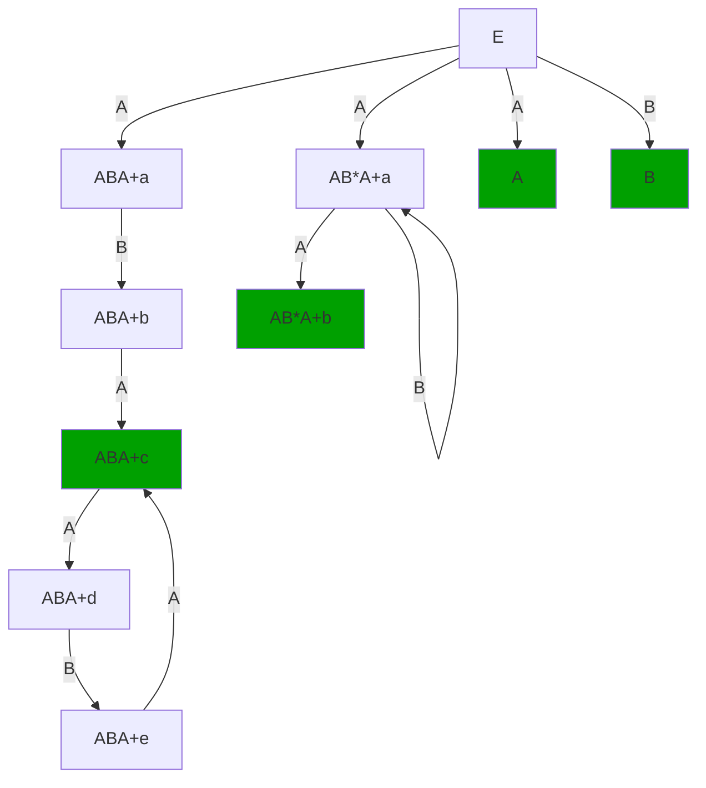
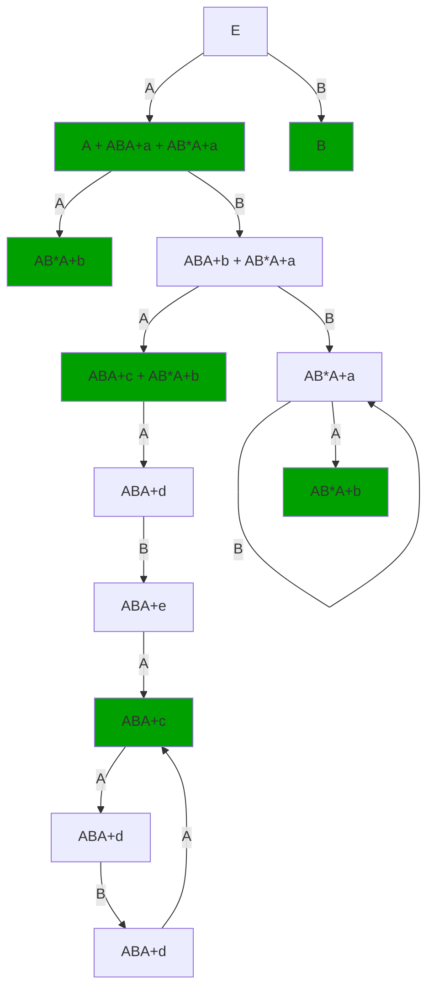
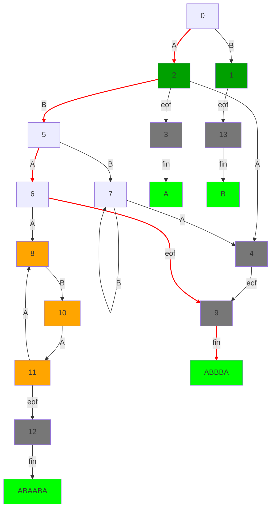

## Ćwiczenia II
### Zadanie 1
niedeterministyczne arcydzieło


_Seeing this beautifull finite automata fills you with determination_


***
### Zadanie 2

_akcje semantyczne_ = jest to jakiś kawałek kodu jaki lekser wykonuje gdy zmatchowany zostanie kawałek tekstu.

```
{
  open Printf
}


rule automat = parse
  | "A""B"*"A"eof { printf "AUTOMAT AKCEPTUJE AB*A\n"
  }
  | "ABA"+eof { printf "AUTOMAT AKCEPTUJE ABA+\n"
  }
  | "B"eof { printf "AUTOMAT AKCEPTUJE <B>\n" 
  }
  | "A"eof	{ printf "AUTOMAT AKCEPTUJE <A>\n" 
  }


{
  let main () =
    let lexbuf = Lexing.from_channel stdin in
    automat lexbuf

  let _ = Printexc.print main ()
}
```

on tam sobie buduje taki automat

***
### Zadanie 3
Zaczniemy od pokazania że języki dane w zadaniu
$$ S \rightarrow (S) | SS | \varepsilon $$
oraz
$$ S \rightarrow S(S) | \varepsilon $$
generują te same języki. 
Żeby pokazać że L1 == L2 pokażemy że L1 zawiera się w L2 i L2 zawiera się w L1.
* **L1 w L2** Tutaj jest prosto.  

Widzimy że:
L1:   
$$ S \rightarrow \varepsilon $$   
ma odpowiednik w L2: 
$$ S \rightarrow \varepsilon $$
Oraz L1: 
$$ S \rightarrow S(S)  $$
ma odpowiednik w L2:
$$ S \rightarrow SS \rightarrow (S)S $$
A skoro każdą produkcję L1 możemy uzyskać złożeniem produkcji w L2, każde wyprowadzenie słowa L1 możemy emulować produkcjami L2. Stąd, L1 należy do L2
* **L2 w L1** Tutaj jest ciężej:  

_powiemy że nawiasowanie ma długość k, jeśli występuje w nim k * '(' oraz k * ')'_
Zakładamy (na mocy indukcji mocnej) że dla każdego nawiasowania długości k-1 wygenerowanego przez L1, mamy odpowiednik produkcji w L2.
Weźmy teraz jakieś nawiasowanie z L2 długości k. Nawiasowanie to będzie skonkatenowanym wyrażeniem `(n)` gdzie n to jakieś (różne) nawiasowania długości mniejszej niż k. Wiemy że umiemy je wyprowadzić w L2 z założeń indukcyjnych. Czyli widzimy że jeśli L2 będzie umiał wyprodukować `(S)(S)(S)...(S)` (tyle nawiasów ile dane nawiasowanie z L1 posiada) to produkcje S->n są już pokazane. No i widać że tak się da (tldr cały czas rozwijamy s bez nawiasu i na koniec ubijamy je epsilonem)

L2 jest jednoznaczna, bo każde nawiasowanie generuje nam graf produkcji. Na wzór tego co było w dowodzie indukcyjnym

***
### Zadanie 4
$$ S \rightarrow (S) | [S] | SS | \varepsilon $$
Jest niejednoznaczny z bardzo prostego powodu. Słowo SSS mogło powstać na dwa sposoby.
$$ S \rightarrow \color{red}SS \rightarrow \color{red}S\color{red}SS $$ 
$$ S \rightarrow S\color{red}S \rightarrow S\color{red}S\color{red}S $$ 

Dlatego też użyjemy tricku z wykładu i dodamy drugi nieterminal.
$$ S \rightarrow S' | SS' | \varepsilon $$
$$ S' \rightarrow (S) | [S] $$
***
### Zadanie 5
E -> E+E' | E-E' | E'
E' -> E' * E'' | E''
E'' -> E''' ^ E'' | E'''
E''' -> id | (E)
***
### Zadanie 6
***
### Zadanie 7
***
### Zadanie 8
***
